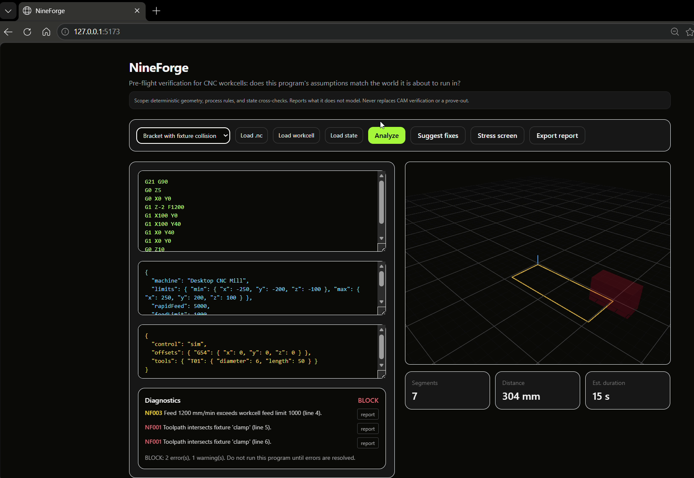
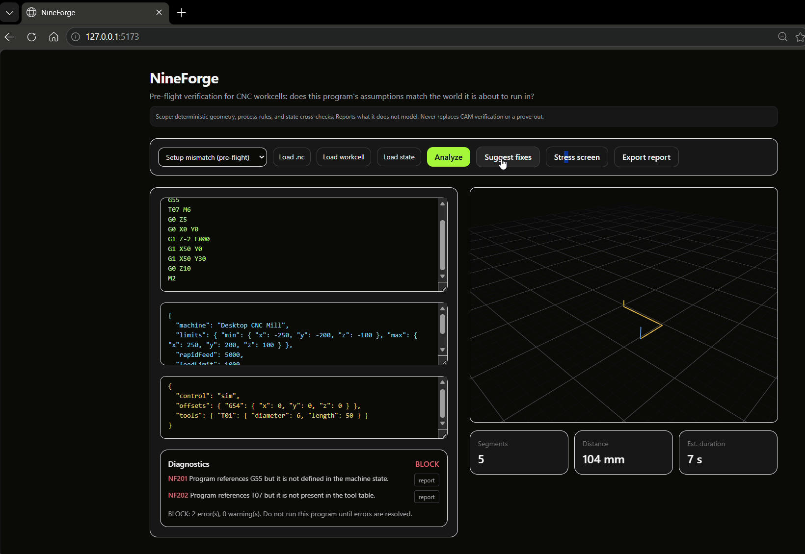
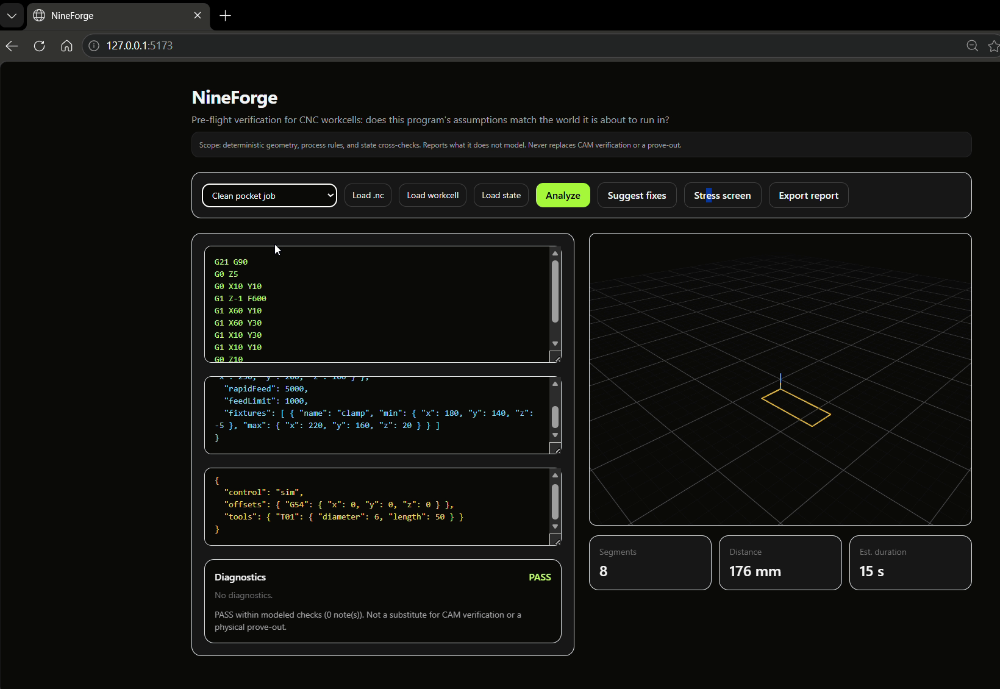
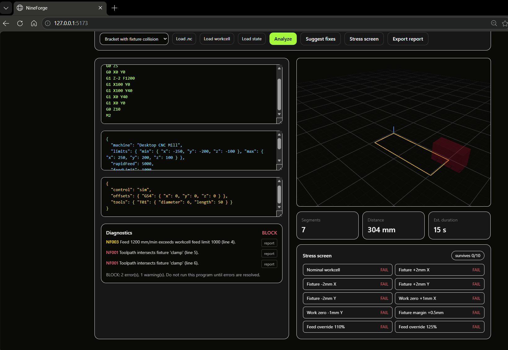
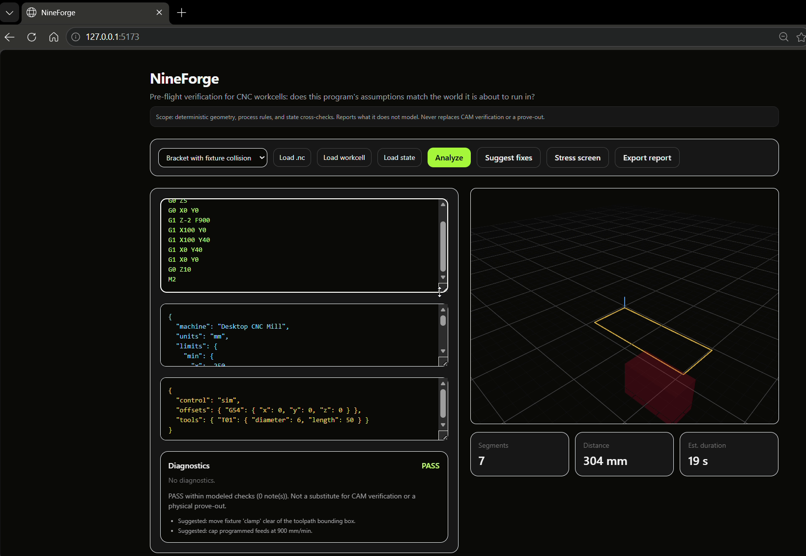
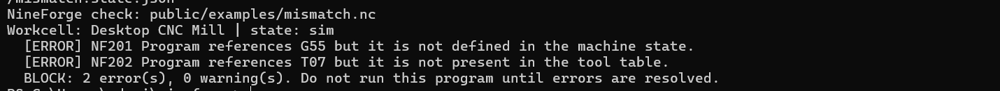

# NineForge

**Unit testing for the physical world.**

NineForge is an open-source, deterministic validation layer for AI-generated machine
programs. It sits between the agent that writes motion code and the hardware that would
execute it — simulating, scoring, and stress-testing every program before anything moves.

The current wedge is **CNC validation**. The engine is designed to be machine-class
agnostic (see roadmap).

> **Scope honesty:** NineForge models deterministic geometry, process rules, and state
> cross-checks, and it reports what it does *not* model. It complements — never
> replaces — CAM verification and a physical prove-out.

## The problem

AI agents now author machine programs (G-code, motion plans) at a scale no human review
process can absorb. In software, a hallucination is a bad string. On hardware, a
hallucinated work offset or a toolpath through a clamp is a broken fixture, a scrapped
part, or an injured operator.

Existing safety nets don't fit the agent era:

- **CAM verification** is human-paced and GUI-bound — it wasn't built to be called in an
  agent loop.
- **Physical prove-outs** are slow, expensive, and don't scale with token throughput.
- **Nothing produces machine-checkable evidence** that a program was validated against
  the *actual* workcell state before deployment.

NineForge's answer: fast, deterministic, CI-friendly checks that turn *"the agent says
it's safe"* into a reviewable evidence trail — and that **block** by default when
evidence is missing.

## The validation state machine

Every run moves through a deterministic pipeline. Any `error`-severity diagnostic at any
stage forces the verdict to `block`; warnings downgrade to `caution`; `pass` requires a
clean trace end to end.

```
   program.nc + workcell.json + state.json
                    │
                    â–¼
            ┌───────────────┐   segments · units · assumptions
            │  1 · PARSE    │   (offsetsUsed, toolsUsed, envelope)
            └───────┬───────┘
                    â–¼
            ┌───────────────┐   assumptions × machine state × workcell
            │  2 · PREFLIGHT│   program calls G55/T07, state defines
            └───────┬───────┘   neither → hard BLOCK before motion
                    â–¼
            ┌───────────────┐   toolpath × fixtures · travel limits ·
            │  3 · ANALYZE  │   feed limits · rapid distance
            └───────┬───────┘
                    â–¼
            ┌───────────────┐
            │  4 · VERDICT  │   block │ caution │ pass
            └───────┬───────┘
                    â–¼
            ┌───────────────┐   diagnostics + stats (segments, distance,
            │  5 · REPORT   │   rapids, duration) → evidence-style report
            └───────┬───────┘
                    ├──────────────────────────┐
                    â–¼                          â–¼
            ┌───────────────┐          ┌────────────────┐
            │  6 · FIX      │          │  7 · STRESS    │
            │  minimal,     │─ re-run ▶│  perturb setup │
            │  deterministic│          │  survives k/N  │
            └───────────────┘          └────────────────
```

Stress never *upgrades* a verdict — it only adds evidence. `survives 0/10` means the
baseline and every tested perturbation (fixture shifts, zero offsets, feed overrides)
still fail.

## UI tour

### 01 — Block: toolpath vs fixture

The bracket program drives the tool through the clamp volume. NineForge blocks the run
and points at the offending lines.

### 02 — Pre-flight: setup mismatch

The program calls for `G55` and `T07`; the loaded machine state defines neither.
**BLOCK** before anything moves.

### 03 — Pass: clean pocket job

A program whose assumptions match the workcell passes every modeled check.

### 04 — Stress screen

The stress screen perturbs the setup (fixture shifts, zero offsets, feed overrides) and
re-runs the checks. "Survives 0/10" means the blocked baseline and every tested
perturbation still fail.

### 05 — Suggested fixes

Deterministic, minimal suggestions: move the fixture clear of the toolpath bounding box,
and cap programmed feeds at the workcell limit.

### 06 — CLI

Same engine, no browser.

## Quickstart

```bash
npm install
npm run dev
```

Open http://127.0.0.1:5173

Headless (CI / agent integration):

```bash
npx tsx cli/main.ts check public/examples/mismatch.nc \
  --workcell public/examples/mismatch.workcell.json \
  --state public/examples/mismatch.state.json
```

Or run the bundled end-to-end example (block + stress):

```bash
npm run check:example
```

More examples live in `public/examples/` (`bracket`, `mismatch`, `clean`, `messy`,
`overtravel`), each as a `program / workcell / state` triple.

## What we model — and what we don't

**Modeled (v0.3):** 3-axis linear/rapid segments · fixture-box collisions · travel
limits · work-offset and tool presence cross-checks (G54–G59, Tnn) · feed limits ·
deterministic perturbations.

**Not modeled (reported as such):** cutting forces, tool deflection, machine dynamics,
controller lookahead, material behavior. See the report's "not modeled" section on every
run.

## Gated roadmap

We ship by evidence gates, not vibes. A gate closes only when its evidence (tests,
examples, screenshots, docs) is in the repo.

| Gate | Goal | Exit criteria |
|------|------|---------------|
| **0 — shipped (v0.3)** | Deterministic 3-axis validation: parse → preflight → analyze → verdict → report, fixes, stress screen, CLI. | This repo: examples, tests, screenshots above. |
| **1 — agent-native** | Stable JSON report schema + exit codes for CI; TypeScript SDK so agents call `check()` inside their loop. | An agent loop self-blocks and applies a suggested fix on the bundled examples with no human in the loop. |
| **2 — deeper physics** | Tool diameter/length cross-checks; 4/5-axis kinematics and rotary envelopes. | 5-axis example suite with evidence parity to Gate 0, plus an updated "not modeled" list. |
| **3 — second machine class** | Prove machine-agnosticism (e.g. FDM motion plans) with the same pipeline and a new workcell schema. | New example suite + screenshots; engine core untouched by machine-specific code. |
| **4 — evidence over time** | Run history, per-workcell regression suites, signed reports. | A regression suite that catches a deliberately broken program change on a real workcell. |

## Contributing

Start with `docs/SCREENSHOTS.md` for the capture guide, and keep the honesty policy:
every new capability must document what it does **not** model.